## Lab 1
### 1- install jenkins with docker image
```bash
    docker run -p 8008:8080 -d --name jenkins jenkins/jenkins:lts
```
### 2- install role based authorization plugin
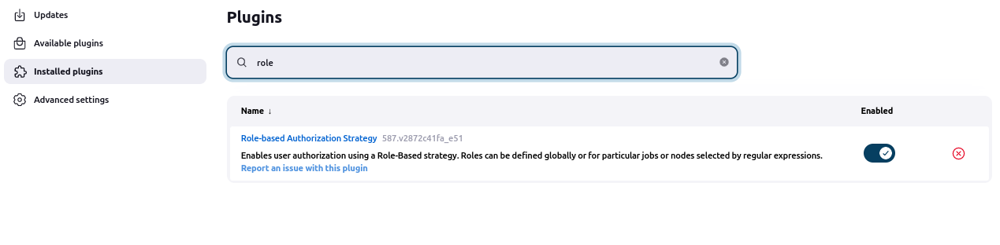
### 3- create new user
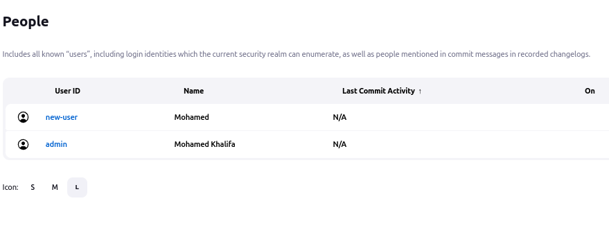
### 4- create read role and assign it to the new user
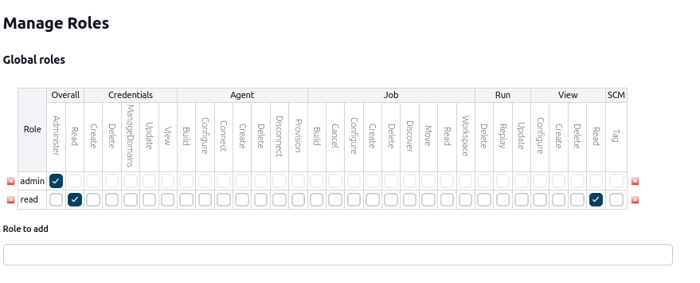

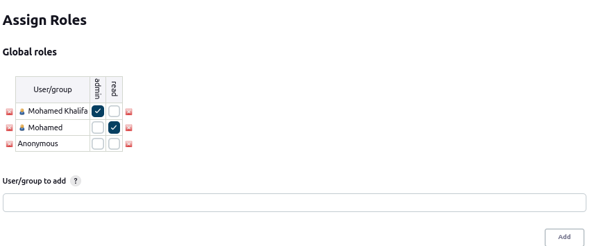
### 5- create free style pipeline and link it to private git repo(inside it create directory and create file with "hello world")
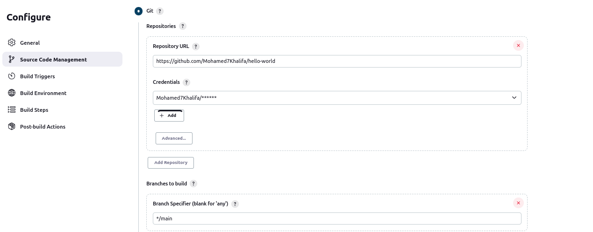

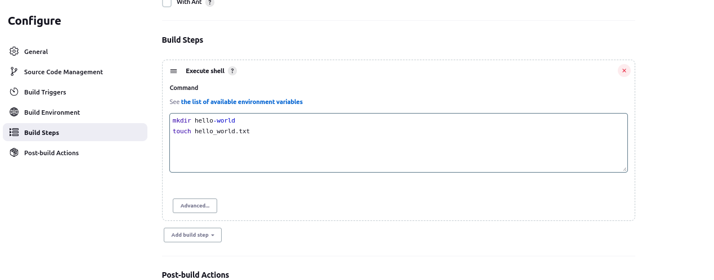

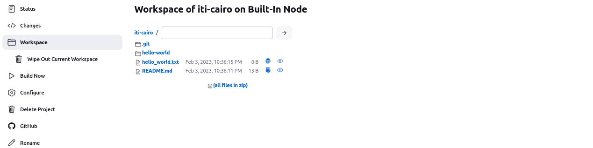

#################
## Lab 2

### 1- create declarative in jenkins GUI pipeline for your own repo to do "ls"
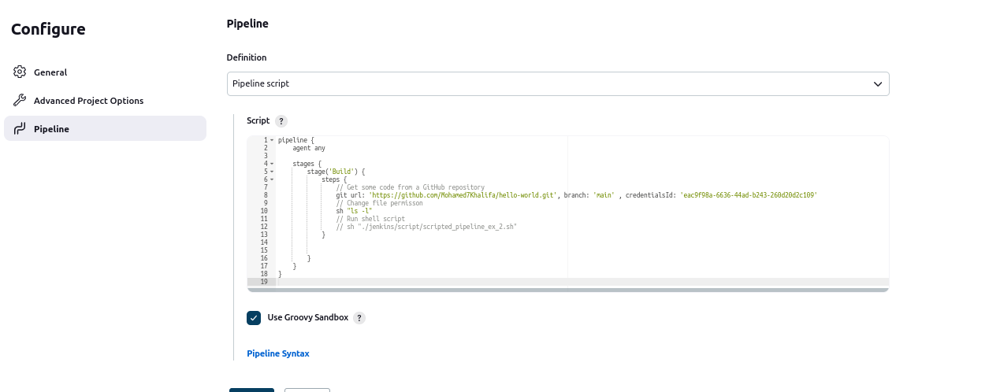

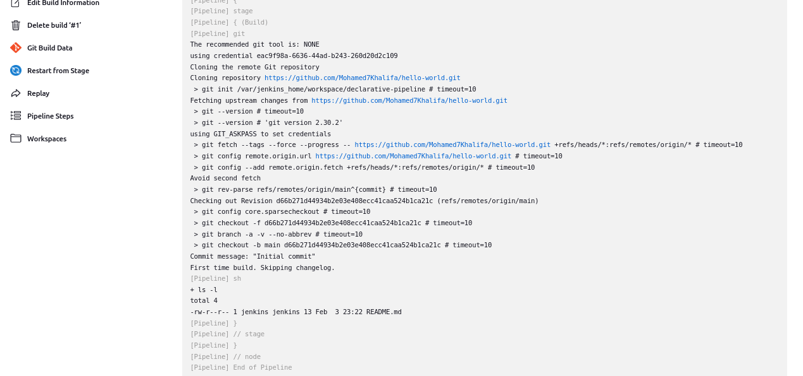

### 2- create scripted in jenkins GUI pipeline for your own repo to do "ls"
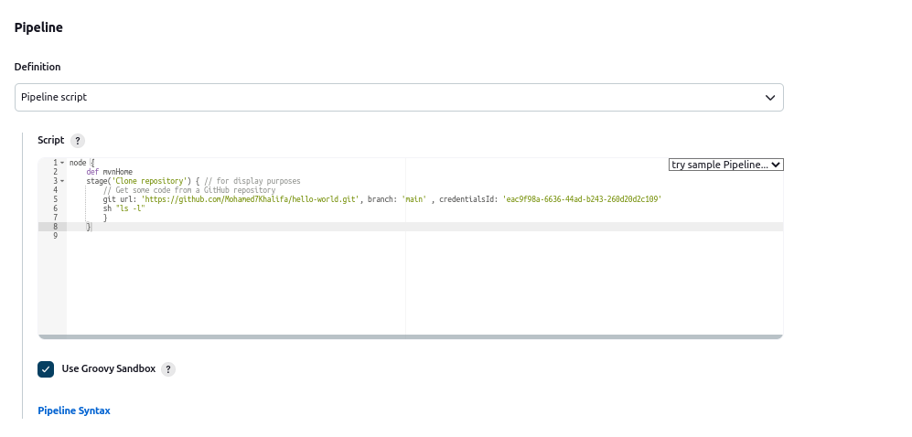

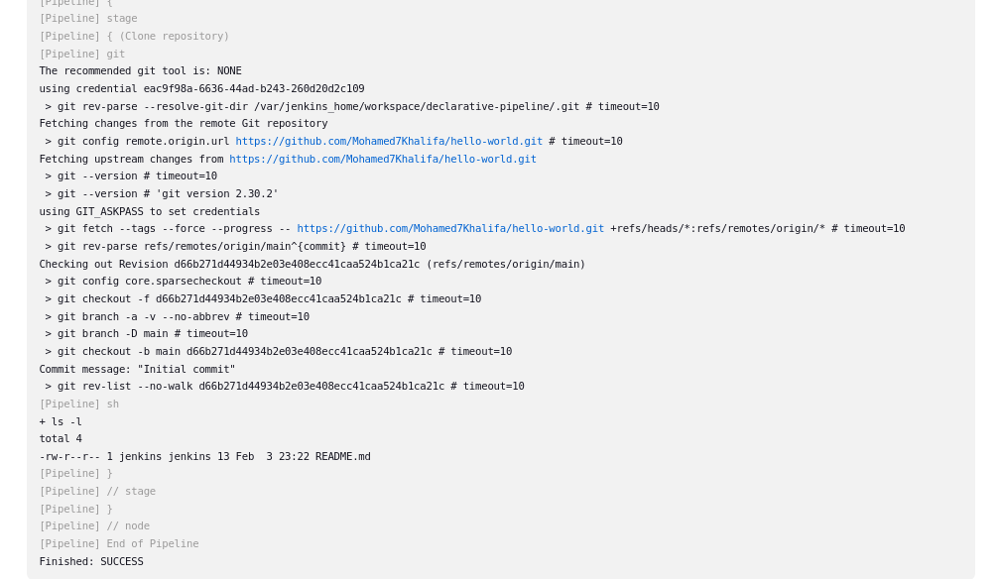

### 3- create the same with jenkinsfile in your branches as multibranch pipeline
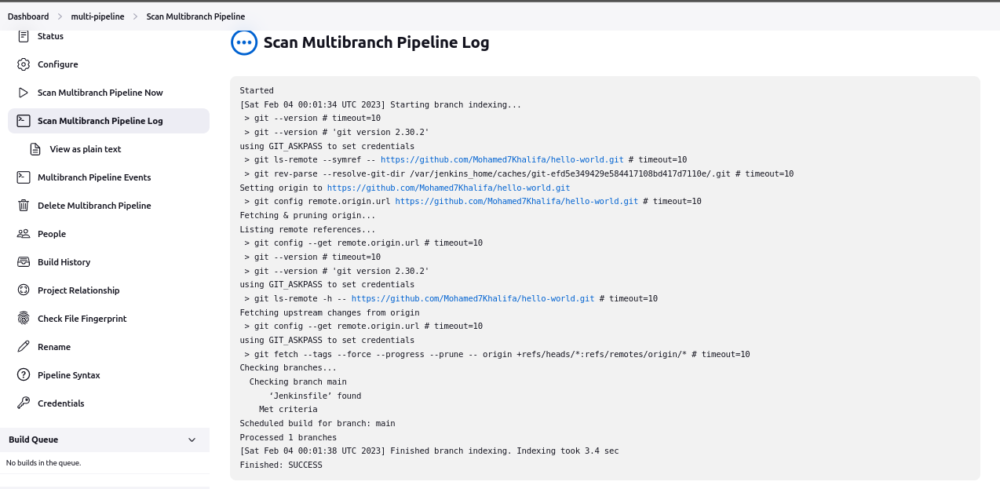

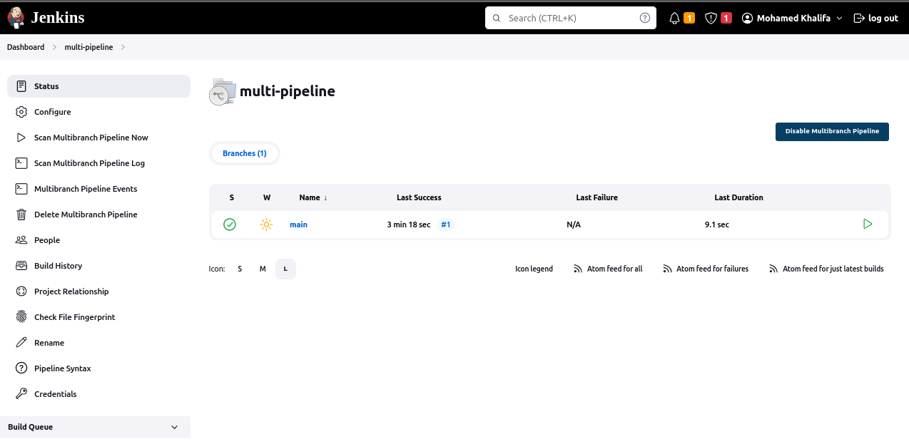
