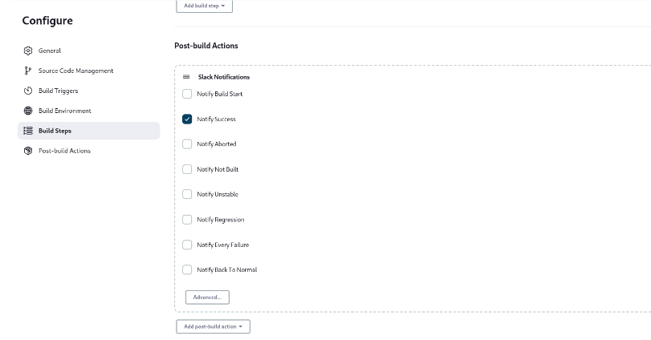

### 4- configure jenkins image to run docker commands on your hos docker daemon
create Docker file 
use volume to the host daemon
```bash
-v /var/run/docker.sock:/var/run/docker.sock
```
### 5- create CI/CD for this repo https://github.com/mahmoud254/jenkins_nodejs_example.git
[!image info](Screenshot/lab2-q2-1.png)
[!image info](Screenshot/lab2-q2-2.png)

#################

### 1- create docker file to build image for jenkins slave

### 2- create container from this image and configure ssh

### 3 from jenkins master create new node with the slave container
create slave file
Configure ssh 

```bash
ssh-keygen -t rsa
```
Then copy the public key to authorized_keys file in .ssh and Copy the private key to jenkins credentials
Then configure Jenkins Node


### 4- integrate slack with jenkins
install slack plugin in jenkins


### 5- send slack message when stage in your pipeline is successful



### 6- install audit logs plugin and test it


### 7- fork the following repo https://github.com/mahmoud254/Booster_CI_CD_Project and add dockerfile to run this django app and use github actions to build the docker image and push it to your dockerhub


